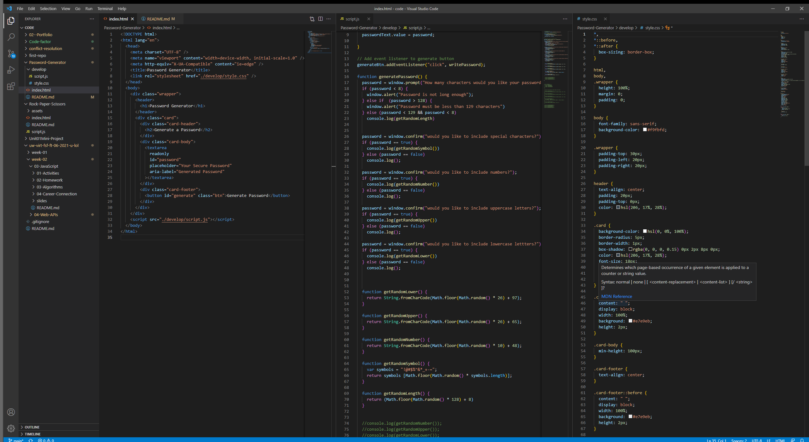

# Password-Generator

I found this project to be difficult. I noticed that I am able to understand javascript concepts on their own, but when it comes to putting them together in multiple uses it becomes harder for me. Overall I was able to figure out how to get each pop up window and the message. The problem I had was connecting the pop-up window message and the actual function itself. I plan on asking for assistance so that I can figure it out and complete the project entirely. 

[Github](https://github.com/LewisCapers206/Password-Generator)